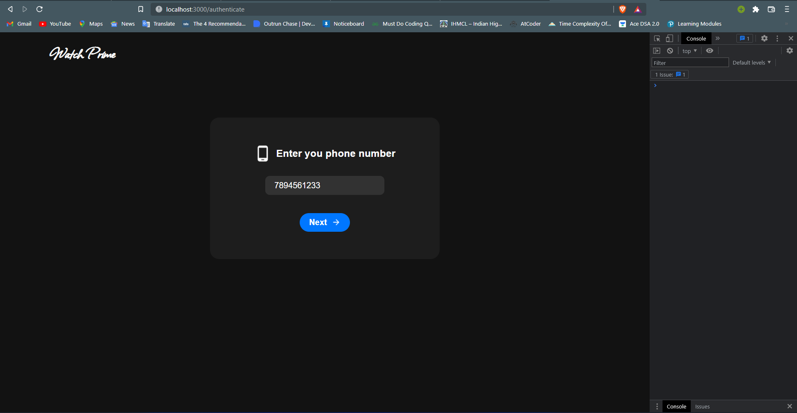
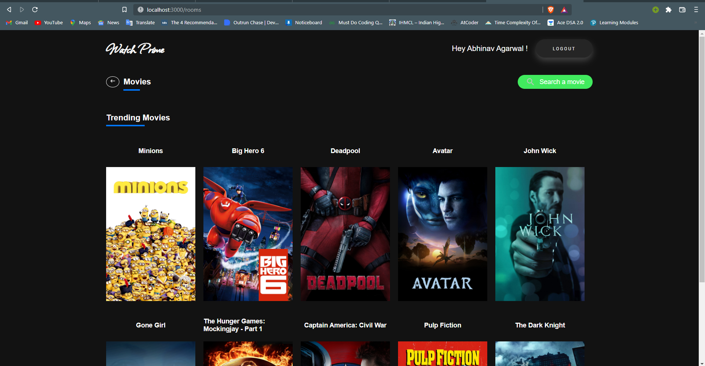
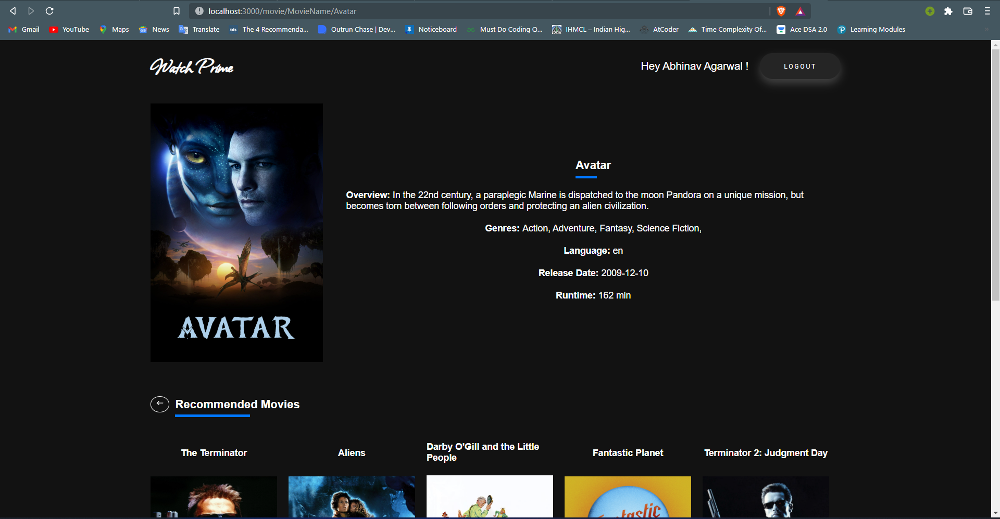
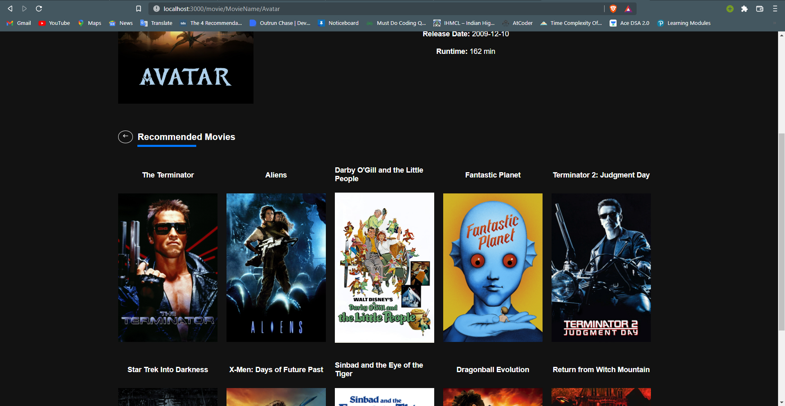

# movie_recommendation_engine

  

> A movie recommendation engine developed with react, express and flask.

## Features

Recommendation App has the following features:

- [x] Trending Movies.
- [x] Recommends movies using Hybrid Recommendation engine.

## Recommendation Engine WorkFlow

  The Hybrid recommendation engine has the following workflow:

  <strong> Input: </strong> User ID and title of the movie
  <br>
  <strong> Output: <strong> Similar movies sorted on the basis of expected ratings by that particular user.
  
## The Idea
  
  This Engine is made using both <em>Collaborative filtering</em> as well as <em>Content based Reommendation</em>.
  
  ### Collaborative Filtering
  
  >Collaborative Filtering is based on the idea that users similar to a me can be used to predict how much I will like a particular product or service those users have used/experienced but I have not. I will use the Surprise library that used extremely powerful algorithms like Singular Value Decomposition (SVD) to minimise RMSE (Root Mean Square Error) and give great recommendations.
  
  ### Content Based Recommendation
  
  >An engine that computes similarity between movies based on certain metrics and suggests movies that are most similar to a particular movie that a user liked. I will be using the Cosine Similarity to calculate a numeric quantity that denotes the similarity between two movies. I have used the TF-IDF Vectorizer, calculating the Dot Product will directly give us the Cosine Similarity Score. Therefore, I will use sklearn's linear_kernel instead of cosine_similarities since it is much faster.
  
  ### Trending Movies
  
  > Trending movies are returned on the bases of popularity of the movies which are in the top of the list in the dataset.
  
## Demo
  
  - Homescreen:


  
  - Login screen:
  
>Enter a mobile number to login
  

  
  - OTP screen:
  
>You will receive a OTP in console. 
  

  
  - Trending Movies screen:
  

  
  - Search Movies screen:
  

  
  - Search Movie Description:
  

  
  - Search Movie Recommendations:
  

  
  ## Application of Agile Methodology
<br>
Microsoft and the Acehacker team kept various sessions for us to learn more about the work culture at Microsoft. We also learned about new technologies that have been developed by Microsoft and about the Agile Methodology. <br><br>

The <strong>Agile Scrum Methodology</strong> has heavily influenced my work in the past 1 month. 
Agile scrum methodology is a project management system that relies on incremental development. Each iteration consists of 2-4 sprints, where each sprint's goal is to build the most important features first and come out with a potentially deliverable product. <br>
Microsoft assigned us three sprints of 1-2 weeks each: <strong>Design, Build, and Adopt.</strong><br><br>
In the <strong>first two weeks</strong>, I evaluated problem statement and started researching about Movie recommendation engine.

In the <strong>third and fourth week</strong>, I worked on Content based Recommendation engine and completed it giving recommendation on the basis of movie name and genre, cast and Director name. <br><br> Repo link for content based recommendation engine: https://github.com/Abhinav-Agarwal021/Content_based_recommendation <br>

In the <strong>last week</strong>, I decided to do better my algorithm or using better functions to recommend movies and implemented hybrid Recommended engine which give different movie recommendations on different user ratings on the movies. <br><br>
  
 ## Prerequisites

You must have the following installed:

- [Node.js v12+](https://nodejs.org/en/download/)
- [python v3.10.2](https://www.python.org/downloads/)
  
## Build Instructions

Running the Web App on your Local System
--------------------------------

To run the web app in your local device, run the following commands in your terminal:-

Clone the GitHub repository into your local device by running the following command:
```bash
git clone https://github.com/Abhinav-Agarwal021/movie_recommendation_engine
  
cd movie_recommendation_engine
```
In the project directory:
  You need to switch on three terminals.
  
 Terminal 1:
  ```bash
cd client
  
npm install
  
npm start
```
  
  Terminal 2:
  ```bash
cd express_server
  
npm install
  
npm start
```
  
  Terminal 3:
  ```bash
cd flask_server
  
python -m venv venv
  
venv/scripts/activate
  
pip install -r requirements.txt
  
python app.py
```
  
Then you are good to go!!
